# Ravi Shanker Pandey

<p align="center">
  
</p>

<p align="center">
  <strong>Artificial Intelligence & Machine Learning · Computer Science · Problem Solving</strong>
</p>

<p align="center">
  <a href="mailto:pandeyharshravi@gmail.com">Email</a> ·
  GitHub ·
  LinkedIn ·
  LeetCode ·
  Codolio
</p>

---

## 👋 About Me

I’m **Ravi Shanker Pandey**, a Computer Science Engineering undergraduate specializing in **Artificial Intelligence & Machine Learning** at **Galgotias University, Greater Noida**.

I have a strong interest in **problem solving and software development**, while continuously strengthening my programming skills, building academic projects, and developing core computer science fundamentals.

> **Current focus:** Programming · Data Structures · OOP · DBMS · SQL · Software Development · AI & ML

---

## 🎓 Education

### Galgotias University — Greater Noida, India

**B.Tech in Computer Science Engineering (AI & ML)**  
**CGPA:** 8.90 / 10.00  
**Expected:** July 2028

---

## 🛠️ Technical Skills

### Programming Languages
`C` `Java` `Python`

### Query Language
`SQL`

### Frontend Development
`HTML` `CSS`

### Tools
`Git` `GitHub` `VS Code` `Eclipse`

### Core Computer Science
`Data Structures` `Object-Oriented Programming` `Database Management System`

### Soft Skills
`Problem Solving` `Teamwork` `Communication` `Time Management`

---

## 🚀 Featured Projects

### 📚 Student Management System
**Feb 2025 – Apr 2025**

**Tech Stack:** Java · SQL

- Developed the concept of a system for efficiently storing, organizing, and managing student records.
- Explored the structure and workflow of a student management system.
- Worked with functionality including adding, updating, and viewing student information.
- Reviewed application functionality and suggested usability improvements for reliable student record management.

---

### 💼 Job Application Tracker
**Nov 2024 – Jan 2025**

**Tech Stack:** Java · SQL · HTML · CSS

- Developed a web-based application concept for organizing multiple job applications through a single dashboard.
- Implemented functionality around company details, application dates, interview dates, and application status.
- Included AI-assisted guidance within the project workflow.
- Supported tracking through statuses such as **Pending, Selected, and Rejected**.

---

## 📜 Certifications

- **Generative AI** — Oracle
- **Python** — HackerRank
- **CSS** — HackerRank
- **SQL** — Oracle

---

## 🏆 Achievements

- Solved **250+ coding problems** across platforms including LeetCode and GeeksforGeeks.
- Completed a **Virtual Job Simulation of JP Morgan**.

---

## 🧠 Core Interests

```text
Artificial Intelligence & Machine Learning
            ↓
     Computer Science
            ↓
    Problem Solving
            ↓
 Programming & Software Development
            ↓
 Data Structures · OOP · DBMS · SQL
```

---

## 🔗 Find Me Online

| Platform | Profile |
|---|---|
| 📧 Email | [pandeyharshravi@gmail.com](mailto:pandeyharshravi@gmail.com) |
| 🐙 GitHub | [Ravi82200](https://github.com/Ravi82200) |
| 💼 LinkedIn | [ravi-pandey-aiml](https://www.linkedin.com/in/ravi-pandey-aiml/) |
| 🧩 LeetCode | [Ravi_Pandey16](https://leetcode.com/u/Ravi_Pandey16/) |
| 📊 Codolio | [Ravi Pandey](https://codolio.com/profile/Ravi%20Pandey) |

These are the profile links supplied for this GitHub profile.

---

## 📌 Currently Building

Strengthening core programming and computer science fundamentals while building academic projects and improving problem-solving skills.

---

<p align="center">
  <i>Learning. Building. Solving. Improving.</i>
</p>

<p align="center">
  <sub>Profile information based on the supplied resume.</sub>
</p>
